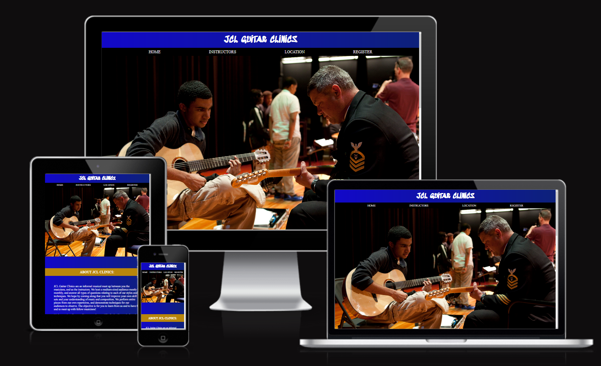
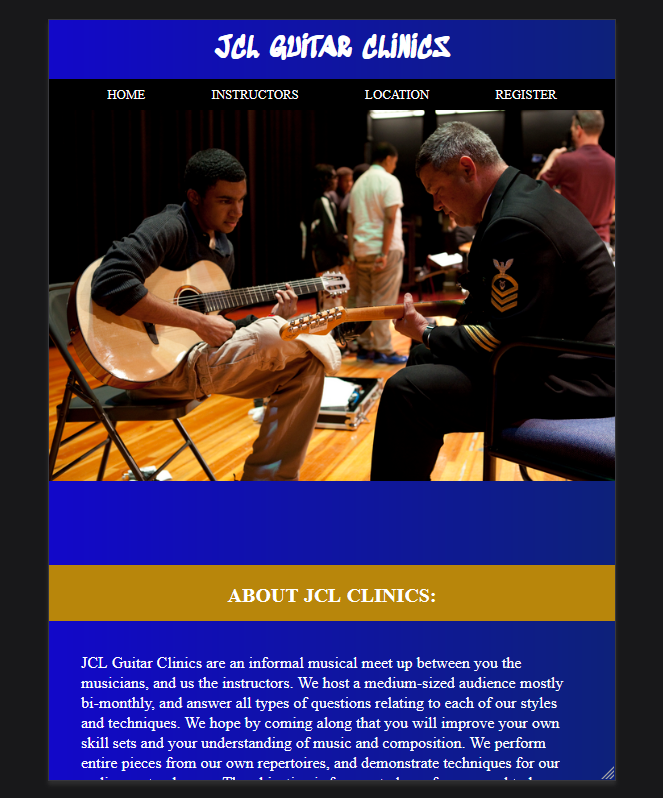
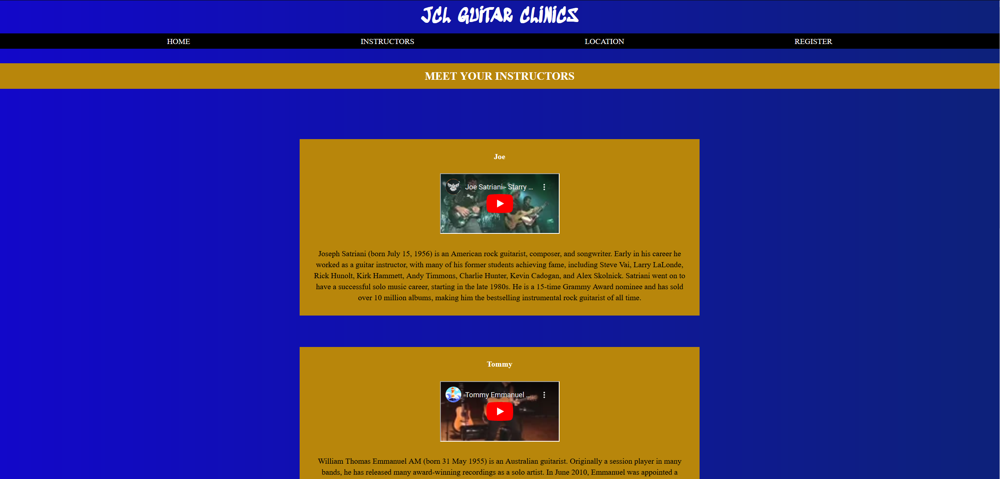
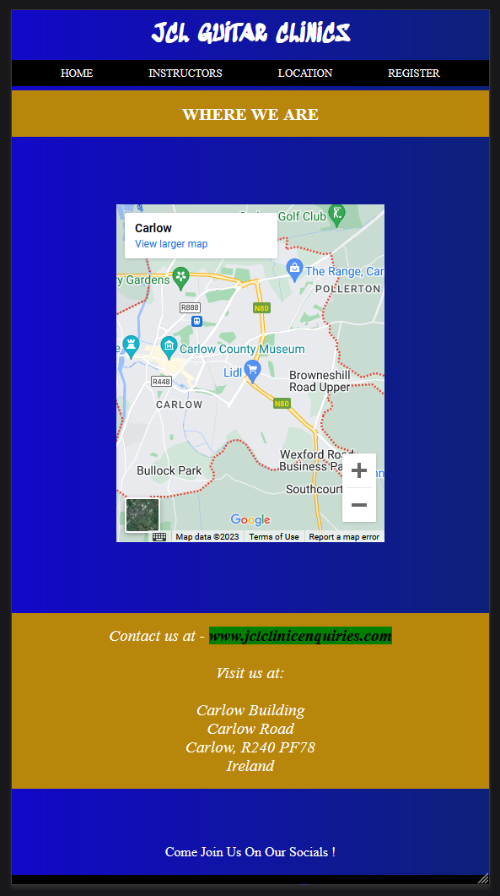
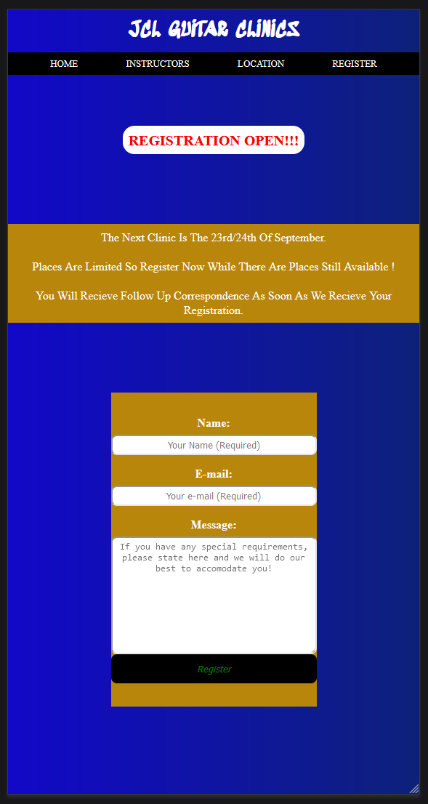
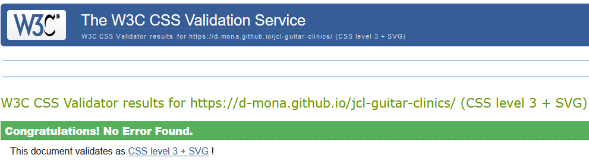

# JCL Guitar Clinics

JCL Guitar Clinics ia a fictional website for musicians(guitar players) who would like to improve their knowledge of music and playing techniques. It caters to musicians of any ability and has open registrations approximately once every two months. Registration is open for 3 days before an event has been organised and registrations are based on a first come first served basis. This is to allow a diverse group of players to get an opportunity to attend a clinic.

Users of the site will find info on the instructors who participate in the clinic and their styles and music, demonstrated by some video content and introductory information. If registrations are available they will be able to register their interest through an application form and subsequently will be contacted with follow up information relating to the event as soon as the organisers have recieved their details.

## Features

### Existing Features

- **Navigation Bar**

  - Featured in a fixed header at the top of all four main pages, as well as the redirected Thank you page when a user has successfully registered. It includes links to the Home page, Instructors page, Location page and Registration page. The Logo/Title is also anchored to the Home page.

- **The Home Page**

- The Home page begins with a photograph of particpants playing together at a previous clinic.
This relays to the user that it will be an engaging and fun experience and a chance to meet with like minded fellow musicians.
- The next section contains all of the information relating to the clinic that leaves the user clear as to what to expect from any hosted events.
- The final section is photograph and quote from one of the instructors and the event organiser, Pat. This gives a personal touch to the page and reminds users to check regularly for open registrations.
- There is a footer at the very end of the page that contains links to all the socials of JCL Guitar Clinics.

- **The Instructors Page**

- This page showcases the four instructors and contains brief bios of each as well as a video of each of the instructors in a live performance.
- The user should be clear as to what styles of music will be performed, as well as the abilities of each instructor.

-  **The Location Page**

- This page contains the address and any contact details of the clinic, as well a Google map of the location.
- Users can decide if the venue is within their means of transport to attend an event.

- **The Registration Page**

- This page contains a contact form for users to register if registration is available.
- users must enter their name, email and optional section if any special requirements may be needed.
- It validates the users inputs to assure proper registration success from the applicant.
- It redirects to a thank you page if successful.

**The Footer**

- There is a footer at the very end of every page that contains links to all the socials of JCL Guitar Clinics.
- Users can choose to participate if desired, or look for footage of previous events, if available.

## Testing

- I tested that the site functions correctly on Firefox, Chrome, Edge and Safari.

- I tested that the project is reponsive on all devices using dev-tools.

- I tested that all navigation performs as intended.

- I tested the registration form for the correct validation of user inputs.

### Validator Testing

- HTML
  - No errors were returned when passing through the official 

  

- CSS
  - No errors were found when passing through The W3C CSS Validation Service.
  
  

### Unfixed Bugs

None.

## Deployment

- The site was deployed to GitHub pages. The steps to deploy are as follows:
- In the GitHub repository, navigate to the Settings tab
- From the options select Pages.
- Choose a branch, main in this case.
- Select the root folder.
- Click save.

The live link can be found here - https://d-mona.github.io/jcl-guitar-clinics/ .

## Credits

### Content

- The instructor information on the Instructors page was taken from each musicians page on https://www.wikipedia.org/ .
- All of the videos on the Instructors page are from https://www.youtube.com .
- All icons in the footer were taken from https://fontawesome.com .

### Media

- All photos on the Home page were taken from https://commons.wikimedia.org .
- Images on the registration form and Thank you page were taken from https://www.pexels.com/ .

